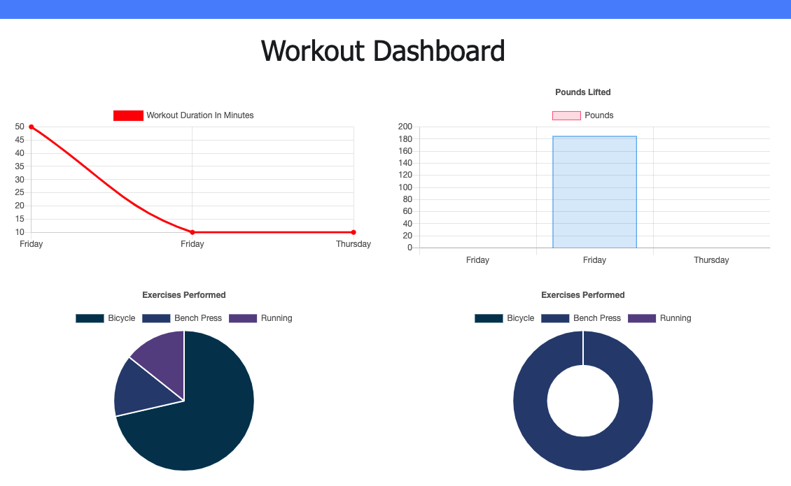

## Fitness Tracker

;

# This Workout Trackers uses MongoDB to store and access data for the charts

# This app allows you to do the following:

* Add exercises to the most recent workout plan

* Add new exercises to a new workout plan

* View the combined weight of multiple exercises from the past seven workouts on the dashboard

* View the total duration of each workout from the past seven workouts on the dashboard

